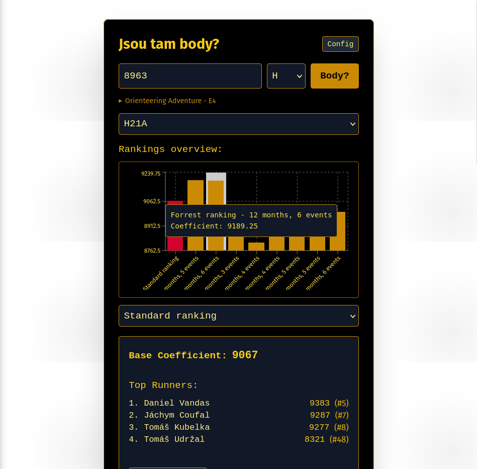

# Jsou tam body?

You know that feeling, when you are fresh wannabe orienteering runner and you're eager to hunt down ranking points, to prove yourself whatever?

Yeah.

Now u don't have to spend long hours to manually scrapping and calculating *Points base* coeficient to know, if potential ranking point gain is worth it. (_"Yeah, Ostrava is basically Dagobah-but points? They are real, I can see now. Thanks **[Jsou tam body?](https://facktorial.github.io/jsou-tam-body/)**!"_)

Some might use this tool to choose right class to attempt. _"This class? No competition—no points. The other one? A bloodbath for scraps... hmmm.... Thank you **[Jsou tam body?](https://www.youtube.com/watch?v=oT3mCybbhf0&list=RDoT3mCybbhf0&start_radio=1)**!"_)

Also, if u already failed your attempt, and you can predict mid-winner-time. U don't have to wait to results are published-you can be disappointed immediately... get crushed by reality in real-time, no waiting.

During pre-race prep, u can spend days sleepless nights haunted by fact knowledge of how many points you will lose for every damned second lost to a mistake.

Another inspiration for this project is overview of Base points distributions across different rankings, which are now tested and runs in experimental mode. (as of June 2025)

## Architecture
* In Czech are orienteering competitions registered on the ORIS portal. 
* This project, via webapp GUI, requests data scraping via the [ORIS API](https://oris.orientacnisporty.cz/API).
* Server sends response via endpoint in JSON. Meanwhile, dockerized Haskell server is hosted at [Railway](https://railway.com/).
* Results are visualized in interactive React.js single page app, which is deployed to GitHub Pages.


Technical foundation
--------------------

| Technology   | Component                                                     |
| ------------ | ------------------------------------------------------------- |
| [**Haskell**]    | Server, scrapping from response to ORIS API requests    |
| [**React.js**]  | GUI for app, sends requests to server, visualize results |
| [**Docker**] | Common conteiner for virtualization, provide easy deployment of server |
| [**Stack**]    | Haskell build system                                      |
| [**Hoomans**]    | From hoomans for hoomans                          |

[**Haskell**]: https://www.haskell.org/
[**React.js**]: https://react.dev/
[**Docker**]: https://docker.com/
[**Stack**]: https://https://docs.haskellstack.org/en/stable/
[**Hoomans**]: https://www.youtube.com/watch?v=fQGbXmkSArs&t=18s

How to run
----------
* server: 
  `./backend/>$ docker build -t kde-jsou-body-api:latest`
  `./backend/>$ docker run -p 8000:8000 kde-jsou-body-api`
* frontend: `../frontend/>$ npm start` 

Endpoints
--------------------
Base URL: `https://empowering-connection-dev.up.railway.app/api/`

All responses are in JSON format.

`GET /api/{eventID}/{gender}/{optionally?}`

### Examples
```
GET /api/9413/H/true
GET /api/9413/H/false
GET /api/8963/D
```
## Screenshot


